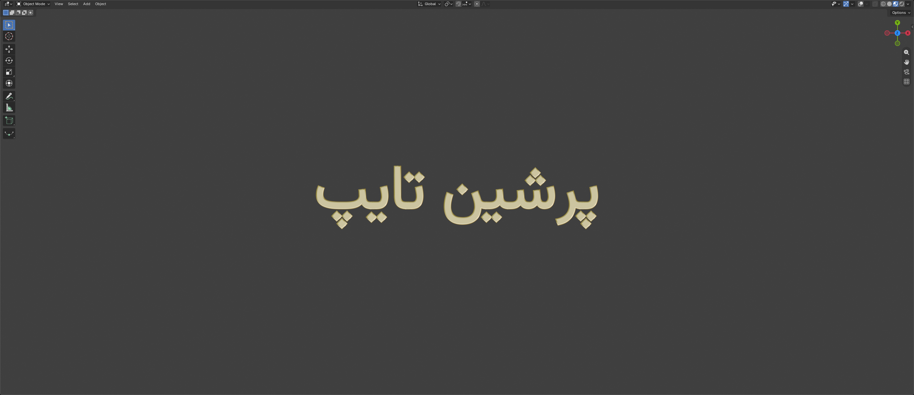
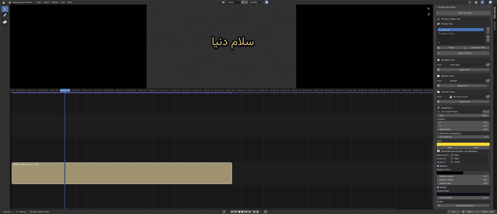
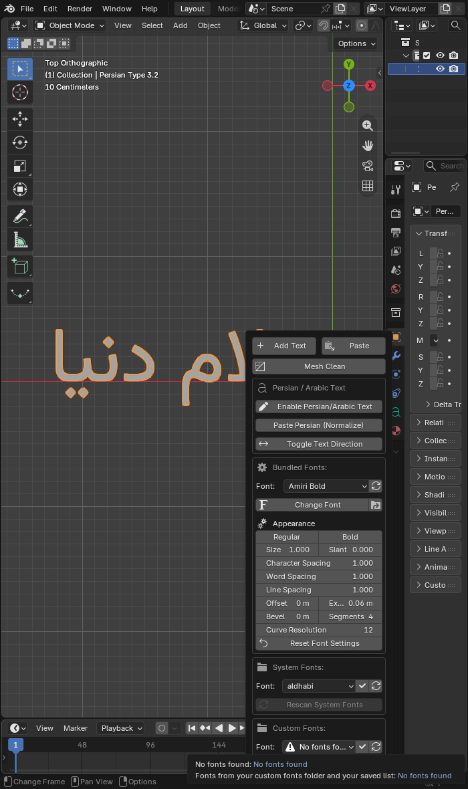
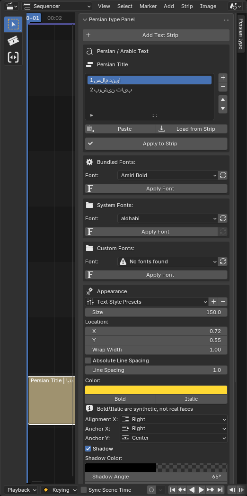
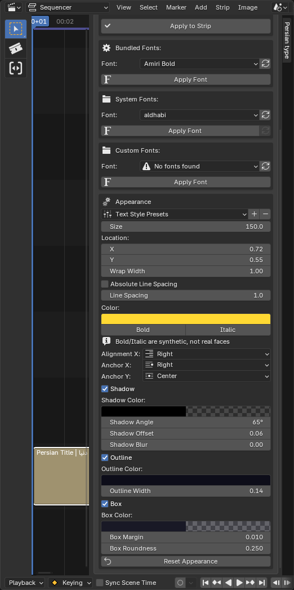

# Persian Type 3.3 — افزونه تایپ فارسی و عربی برای Blender

ساخت، تایپ، چسباندن، تنظیم فونت و تبدیل متن فارسی یا عربی به Mesh تمیز، مستقیماً داخل Blender.

Create, type, paste, style, and convert Persian or Arabic text into a clean mesh directly inside Blender.

[دانلود نسخه 3.3](https://github.com/damyarpro/PERSIAN-TYPE/releases/tag/v3.3) · [Download version 3.3](https://github.com/damyarpro/PERSIAN-TYPE/releases/tag/v3.3)

---

## فارسی

### قابلیت‌های اصلی نسخه 3.3

- **Add Text:** ساخت فوری متن راست‌چین «پرشین تایپ 3.3» در محل 3D Cursor و ورود مستقیم به حالت تایپ فارسی.
- **Paste:** خواندن متن فارسی یا عربی از Clipboard، نرمال‌سازی حروف و آماده‌سازی برای ادامه تایپ و پاک‌کردن.
- **تایپ مستقیم فارسی و عربی:** پشتیبانی از تایپ، Backspace، Delete، حرکت مکان‌نما و خطوط چندگانه در Edit Mode.
- **تغییر جهت متن:** جابه‌جایی سریع میان راست‌به‌چپ و چپ‌به‌راست.
- **انتخاب فونت:** سه فهرست جدا — فونت‌های همراه افزونه، فونت‌های سیستم‌عامل، و فونت‌های اختصاصی شما.
- **تنظیمات ظاهر فونت:** وزن Regular/Bold، اندازه، شیب، فاصله حروف، کلمات و خطوط، Offset، Extrude، Bevel و Curve Resolution.
- **Mesh Clean:** تبدیل Text انتخاب‌شده به Mesh و پاک‌سازی خودکار توپولوژی.
- **پشتیبانی از Video Sequencer:** ساخت و ویرایش متن فارسی روی Text Stripها در ویرایشگر ویدیو، با تراز راست خودکار و اعمال فونت‌های همراه افزونه.
- **ویرایش چندخطی:** فهرست خط‌ها با افزودن، حذف و جابه‌جایی، به‌جای یک فیلد تک‌خطی.
- **تنظیمات ظاهر استریپ:** اندازه، موقعیت، عرض شکست خط، فاصله خطوط، رنگ، بولد و ایتالیک، تراز و لنگر، و سه افکت سایه و خط دور و جعبه با رنگ اختصاصی هرکدام.
- **پیش‌تنظیم استایل متن:** ذخیره یک ظاهر و اعمال آن روی استریپ‌های دیگر، با همان مکانیزم خود Blender.
- **سه فهرست فونت جدا:** فونت‌های همراه افزونه، فونت‌های سیستم، و فونت‌های اختصاصی شما.
- **فونت سیستم چندسکویی:** اسکن بازگشتی روی Windows و macOS و Linux، با پشتیبانی از `.ttc`.
- **رندر درست اعداد:** تاریخ، ساعت، شماره نسخه و عدد اعشاری حالا به ترتیب درست نمایش داده می‌شوند. پیش‌تر `3.2` به شکل `2.3` و `12:30` به شکل `30:12` دیده می‌شد.
- **بازخوانی متن اصلاح شد:** حرف «ک»، حرف «ی» در حالت میانی، و ارقام و واژه‌های لاتین دیگر هنگام Load خراب نمی‌شوند.
- **فارسی خوانا در خود پنل:** فهرست خط‌ها متن را شکل‌گرفته و راست‌چین نشان می‌دهد، نه به‌هم‌ریخته.
- **سازگار با Blender 5:** حداقل نسخه موردنیاز Blender `5.0.1` است و API نسخه `5.2 LTS` نیز بررسی شده است.

### نصب

1. فایل [`persiantype-3.3.0.zip`](https://github.com/damyarpro/PERSIAN-TYPE/releases/download/v3.3/persiantype-3.3.0.zip) را دانلود کنید.
2. در Blender وارد `Edit > Preferences > Get Extensions` شوید.
3. از منوی بالا گزینه `Install from Disk` را انتخاب کنید.
4. فایل ZIP را انتخاب و افزونه را فعال کنید.
5. در 3D Viewport، پنل کناری را با کلید `N` باز کنید و وارد تب **Persian type** شوید.

### شروع سریع

پنل سه‌بعدی در نوار کناری 3D Viewport، تب **Persian type** قرار دارد. با کلید `N` بازش کنید.

علاوه بر ساخت و چسباندن متن، این پنل **Mesh Clean**، تغییر جهت متن، سه فهرست فونت، و بخش ظاهر با وزن Regular و Bold، اندازه، شیب، فاصله حروف و کلمات و خطوط، Offset، Extrude، Bevel و Curve Resolution را در اختیار می‌گذارد.

#### ساخت متن جدید

1. روی **Add Text** کلیک کنید.
2. یک Text Object راست‌چین در محل 3D Cursor ساخته می‌شود.
3. متن نمونه را با صفحه‌کلید ادامه دهید یا با Backspace پاک کنید.

#### چسباندن متن فارسی یا عربی

1. متن را در Clipboard کپی کنید.
2. روی **Paste** کلیک کنید.
3. افزونه حروف عربی `ي` و `ك` را به شکل استاندارد فارسی `ی` و `ک` تبدیل می‌کند، کشیده و ZWJ اضافی را حذف می‌کند و متن را راست‌چین تحویل می‌دهد.
4. مکان‌نما در انتهای متن قرار می‌گیرد و می‌توانید بلافاصله تایپ را ادامه دهید.

### کار با Video Sequencer

پنل در نوار کناری Video Sequencer، تب **Persian type** قرار دارد. برای دیدنش وارد فضای کاری Video Editing شوید، حالت نمایش را روی **Sequencer & Preview** بگذارید و کلید `N` را بزنید.

#### ساخت و ویرایش متن

1. روی **Add Text Strip** کلیک کنید. یک Text Strip راست‌چین در فریم جاری و روی اولین کانال خالی ساخته می‌شود.
2. متن فارسی را در فهرست خط‌ها بنویسید. هر ردیف یک خط است و با دکمه‌های کنار فهرست می‌توانید خط اضافه کنید، حذف کنید یا جابه‌جا کنید.
3. روی **Apply to Strip** بزنید تا متن شکل بگیرد و در استریپ نوشته شود.
4. **Paste** متن Clipboard را با نرمال‌سازی حروف عربی می‌خواند و روی خطوط پخش می‌کند.
5. **Load from Strip** متن موجود استریپ را برای ویرایش دوباره به فهرست برمی‌گرداند.

> اگر متن شما عدد یا واژه لاتین دارد، هنگام **Load from Strip** هشدار می‌گیرید. علتش در بخش محدودیت‌ها آمده است.

#### فونت و ظاهر

فونت پیش‌فرض Text Strip در Blender حروف فارسی را درست نشان نمی‌دهد، پس بعد از ساخت استریپ حتماً یک فونت اعمال کنید. سه فهرست جدا در اختیار دارید:

- **Bundled Fonts:** ۷۶ فونت همراه افزونه.
- **System Fonts:** فونت‌های نصب‌شده روی سیستم‌عامل. اگر فهرست خالی بود دکمه Rescan را بزنید.
- **Custom Fonts:** پوشه فونت دلخواه شما به‌علاوه فونت‌هایی که ذخیره کرده‌اید.

بخش **Appearance** این‌ها را کنترل می‌کند: اندازه، موقعیت روی تصویر، عرض شکست خط، فاصله خطوط با حالت نسبی و پیکسلی، رنگ، بولد و ایتالیک، و ترازبندی افقی و عمودی. سه افکت هم هرکدام پشت کلید خودشان قرار دارند: **Shadow** با زاویه و فاصله و محو، **Outline** با رنگ و ضخامت، و **Box** با رنگ و حاشیه و گردی گوشه.

دکمه **Reset Appearance** همه را به حالت اولیه برمی‌گرداند ولی تراز راست را حفظ می‌کند.

#### پیش‌تنظیم استایل

ردیف **Text Style Presets** بالای بخش Appearance، ظاهر فعلی را ذخیره می‌کند تا با یک کلیک روی استریپ‌های دیگر اعمال شود. از مکانیزم خود Blender استفاده می‌کند، پس پیش‌تنظیم‌هایی که جای دیگری در Blender ساخته‌اید هم اینجا دیده می‌شوند.

پیش‌تنظیم ۲۱ ویژگی را نگه می‌دارد: رنگ، بولد و ایتالیک، اندازه، عرض شکست خط، کل گروه سایه و خط دور و جعبه، ترازبندی و لنگرها، موقعیت، و فونت. فاصله خطوط در پیش‌تنظیم ذخیره **نمی‌شود**، چون Blender آن را در فهرست خود نگذاشته است.

### تنظیم فونت

یک Text Object را انتخاب کنید و از بخش **Font Settings** استفاده کنید:

- انتخاب فونت‌های داخلی افزونه
- انتخاب و Apply کردن فونت‌های سیستم‌عامل
- افزودن پوشه فونت سفارشی
- ذخیره فونت فعلی در فهرست فونت‌های محبوب
- تغییر وزن به Regular یا Bold، در صورت وجود فایل Bold در خانواده فونت
- کنترل Size، Slant، Character/Word/Line Spacing
- کنترل Offset، Extrude، Bevel، Bevel Segments و Curve Resolution
- بازگردانی همه تنظیمات با **Reset Font Settings**

> Blender 5.1 محور وزن Variable Font را مستقیماً در Python API ارائه نمی‌کند. گزینه Bold زمانی اثر متفاوت دارد که خانواده انتخاب‌شده فایل Bold جداگانه داشته باشد.

### Mesh Clean

دکمه **Mesh Clean** روی Text انتخاب‌شده، چه در Object Mode و چه در Edit Mode، این مراحل را اجرا می‌کند:

1. تبدیل Text به Mesh
2. افزودن Decimate Modifier در حالت `Planar / Dissolve`
3. Apply کردن Decimate
4. اجرای `Mesh > Clean Up > Delete Loose`
5. اجرای Merge by Distance با مقدار دقیق `0.01401 m`
6. بازگشت به Object Mode و تحویل Mesh نهایی

Mesh Clean از چند Text Object انتخاب‌شده نیز پشتیبانی می‌کند. توجه کنید که پس از تبدیل به Mesh دیگر امکان تغییر فونت وجود ندارد؛ فونت و ظاهر متن را پیش از Mesh Clean تنظیم کنید.

### فونت‌های همراه

افزونه دارای ۷۶ فونت است. نسخه 3.0 خانواده‌های آزاد زیر را اضافه کرد:

- Vazirmatn
- Estedad
- Lalezar
- Markazi Text
- Noto Sans Arabic
- Noto Naskh Arabic
- Amiri Regular / Bold
- Scheherazade New Regular / Bold

این فونت‌ها با متن فارسی در Blender آزمایش شده‌اند. فایل مجوز SIL Open Font License هر خانواده در مسیر `fonts/licenses` قرار دارد.

### میانبر و ابزارهای قدیمی

- `Ctrl + F1`: فعال‌سازی حالت تایپ فارسی برای Text Object در Edit Mode
- **Enable Persian/Arabic Text:** فعال‌سازی دستی حالت تایپ
- **Paste Persian (Normalize):** چسباندن و نرمال‌سازی متن در Text Object فعلی
- **Toggle Text Direction:** تغییر RTL/LTR
- **Refresh:** بازسازی فهرست فونت‌ها

---

## English

### What’s new in version 3.3

- **Add Text:** Creates the “Persian Type 3.3” RTL text at the 3D Cursor and immediately enables Persian typing.
- **Paste:** Creates right-aligned Persian/Arabic text from the clipboard, normalizes common Arabic characters, and leaves the caret ready for continued editing.
- **Direct Persian/Arabic editing:** Supports typing, Backspace, Delete, cursor navigation, and multiline text in Edit Mode.
- **Text direction:** Quickly switch between RTL and LTR alignment.
- **Font selection:** Three separate lists — the bundled fonts, your operating system's fonts, and your own custom fonts.
- **Font appearance:** Regular/Bold, size, slant, character/word/line spacing, offset, extrusion, bevel, and curve resolution.
- **Mesh Clean:** Converts selected Text objects to Mesh and runs the complete cleanup workflow automatically.
- **Video Sequencer support:** Create and edit Persian text on Video Sequencer text strips, with right alignment applied automatically and the bundled fonts available on the strip.
- **Multi-line editing:** A line list with add, remove and reorder, replacing the single-line field.
- **Strip appearance:** Size, position, wrap width, line spacing, colour, bold and italic, alignment and anchors, plus shadow, outline and box, each with its own colour.
- **Text style presets:** Save a look and apply it to other strips, using Blender's own preset mechanism.
- **Three separate font lists:** the bundled fonts, your system fonts, and your own custom fonts.
- **Cross-platform system fonts:** recursive scanning on Windows, macOS and Linux, including `.ttc`.
- **Numbers render correctly:** dates, times, version numbers and decimals now read in logical order. `3.2` used to render as `2.3` and `12:30` as `30:12`.
- **Read-back fixed:** Keheh, medial Persian Yeh, and Latin and digit runs no longer corrupt when reading text back from a strip or object.
- **Readable Persian inside the panel:** the line list shows shaped, right-aligned text instead of disconnected letters in reverse.
- **Blender 5 support:** Requires Blender `5.0.1` or newer; the Blender `5.2 LTS` API changes have also been reviewed.

### Installation

1. Download [`persiantype-3.3.0.zip`](https://github.com/damyarpro/PERSIAN-TYPE/releases/download/v3.3/persiantype-3.3.0.zip).
2. Open `Edit > Preferences > Get Extensions` in Blender.
3. Choose `Install from Disk` from the menu.
4. Select the ZIP file and enable the extension.
5. In the 3D Viewport, press `N` and open the **Persian type** tab.

### Quick start

The 3D panel lives in the 3D Viewport sidebar under the **Persian type** tab. Press `N` to open it.

Beyond creating and pasting text it offers **Mesh Clean**, text direction toggling, the three font lists, and an appearance section with Regular and Bold weight, size, slant, character, word and line spacing, offset, extrusion, bevel and curve resolution.

#### Create new Persian text

1. Click **Add Text**.
2. A right-aligned Text Object is created at the 3D Cursor.
3. Continue typing immediately or remove the sample with Backspace.

#### Paste Persian or Arabic text

1. Copy Persian or Arabic text to the clipboard.
2. Click **Paste**.
3. The extension normalizes Arabic Yeh/Kaf, removes Tatweel and unnecessary ZWJ characters, and creates an RTL Text Object.
4. The caret remains at the end so typing can continue immediately.

### Working in the Video Sequencer

The panel lives in the Video Sequencer sidebar under the **Persian type** tab. To reach it, open the Video Editing workspace, set the view to **Sequencer & Preview**, and press `N`.

#### Creating and editing text

1. Click **Add Text Strip**. A right-aligned text strip is created at the current frame on the first free channel.
2. Type Persian into the line list. Each row is one line, and the buttons beside the list add, remove and reorder lines.
3. Click **Apply to Strip** to shape the text and write it into the strip.
4. **Paste** reads the clipboard with Arabic character normalization and spreads it across the lines.
5. **Load from Strip** reads the strip's existing text back into the list for further editing.

> If your text contains digits or Latin words, **Load from Strip** warns you. The Limitations section explains why.

#### Fonts and appearance

Blender's default text strip font does not render Persian correctly, so always apply a font after creating a strip. Three separate lists are available:

- **Bundled Fonts:** the 76 fonts shipped with the extension.
- **System Fonts:** the fonts installed on your operating system. Press Rescan if the list is empty.
- **Custom Fonts:** your chosen folder plus any fonts you have saved.

The **Appearance** section controls size, position on frame, wrap width, line spacing in relative or absolute pixels, colour, bold and italic, and horizontal and vertical alignment. Three effects sit behind their own toggles: **Shadow** with angle, offset and blur, **Outline** with colour and width, and **Box** with colour, margin and roundness.

**Reset Appearance** restores the defaults while keeping right alignment.

#### Style presets

The **Text Style Presets** row at the top of Appearance saves the current look so it can be applied to other strips with one click. It uses Blender's own preset mechanism, so presets created elsewhere in Blender appear here too.

A preset stores 21 properties: colour, bold and italic, size, wrap width, the full shadow, outline and box groups, alignment and anchors, position, and the font. Line spacing is **not** stored, because Blender does not include it in its own preset list.

### Font controls

Select a Text Object and use **Font Settings** to:

- Choose from the bundled, system, or custom font lists
- Apply Regular or Bold when a separate Bold font file is available
- Adjust size, slant, and character/word/line spacing
- Adjust offset, extrusion, bevel depth, bevel segments, and curve resolution
- Restore defaults with **Reset Font Settings**

> Blender 5.1 does not expose Variable Font weight axes through its Python API. Bold produces a distinct result when the selected family includes a separate Bold file.

### Mesh Clean workflow

**Mesh Clean** accepts selected Text objects in Object Mode or Edit Mode and performs:

1. Text to Mesh conversion
2. Planar/Dissolve Decimate modifier creation and application
3. `Mesh > Clean Up > Delete Loose`
4. Merge by Distance at exactly `0.01401 m`
5. Return to Object Mode

Multiple selected Text Objects are supported. Font information is no longer editable after conversion, so finish font and appearance adjustments before using Mesh Clean.

### Bundled fonts

The extension includes 76 fonts. Version 3.0 added the following open font families:

- Vazirmatn
- Estedad
- Lalezar
- Markazi Text
- Noto Sans Arabic
- Noto Naskh Arabic
- Amiri Regular / Bold
- Scheherazade New Regular / Bold

All newly bundled fonts were tested by generating Persian geometry in Blender. Their SIL Open Font License files are included under `fonts/licenses`.

## محدودیت‌ها | Limitations

### فارسی

سه نقص بازخوانی که تا نسخه ۳.۲ وجود داشتند در نسخه ۳.۳ رفع شدند: حرف «ک»، حرف «ی» در حالت میانی، و معکوس‌شدن ارقام و واژه‌های لاتین. رندر اعداد هم اصلاح شد، پس تاریخ و ساعت و شماره نسخه دیگر برعکس نمایش داده نمی‌شوند.

آنچه هنوز باقی است:

- **بعضی رشته‌ها ذاتاً قابل بازیابی نیستند.** موتور شکل‌دهی یک‌به‌یک نیست؛ دو متن منطقی متفاوت می‌توانند به یک تصویر یکسان تبدیل شوند، مثل `سلام abc.` و `سلام. abc`. هیچ الگوریتمی نمی‌تواند بین این دو انتخاب کند.
- **یای عربی به یای فارسی تبدیل می‌شود.** یونیکد شکل میانی این دو حرف را یکی کرده، پس تشخیصشان از روی شکل ممکن نیست. چون افزونه فارسی‌محور است، به نفع فارسی حل شده. ظاهر رندرشده عوض نمی‌شود.

در هر دو حالت **Load from Strip** متن بازخوانی‌شده را دوباره شکل می‌دهد و با استریپ مقایسه می‌کند و اگر نخواند هشدار می‌دهد، پس چیزی بی‌سروصدا خراب نمی‌شود.

سه محدودیت دیگر که به خود Blender برمی‌گردند:

- **Bold و Italic روی Text Strip** از نوع مصنوعی Blender است، نه فایل فونت واقعی، و برای فارسی معمولاً خوب درنمی‌آید. متن سه‌بعدی می‌تواند فایل Bold جداگانه بگیرد، Text Strip نمی‌تواند.
- **گرادیان رنگی** روی متن، سایه، خط دور یا جعبه ممکن نیست. Text Strip در Blender فقط رنگ تخت می‌پذیرد.
- **نام فونت‌های سیستم** از نام فایل خوانده می‌شود، که روی Windows کوتاه و نامفهوم است. مسیر کامل در توضیح هر گزینه دیده می‌شود. این هزینه‌ای است که پرداختیم تا فهرست فونت در هر بار رسم مجدد، دیتابلاک فونت نسازد.

### English

The three read-back defects that existed through 3.2 are fixed in 3.3: Keheh, medial Persian Yeh, and reversed Latin and digit runs. Number rendering is fixed too, so dates, times and version numbers no longer display backwards.

What remains:

- **Some strings cannot be recovered in principle.** The shaping engine is not injective; two different logical texts can produce one identical image, such as `سلام abc.` and `سلام. abc`. No algorithm can choose between them.
- **Arabic Yeh folds onto Persian Yeh.** Unicode unifies the two letters' medial forms, so the shape cannot say which it came from. Since this is a Persian-first add-on it resolves towards Persian. The rendered result is unchanged.

In both cases **Load from Strip** re-shapes what it read, compares it against the strip, and warns you when they differ, so nothing is corrupted silently.

Three further limits, all of them Blender's:

- **Bold and Italic on a text strip** are Blender's synthetic styles rather than real font faces, and they suit Persian poorly. A 3D text object can take a separate Bold file; a text strip cannot.
- **Colour gradients** are not possible on the text, shadow, outline or box. Blender's text strip accepts flat colour only.
- **System font names** come from filenames, which on Windows are terse. Each entry's description shows the full path. This is the cost of keeping the font lists from creating a font datablock on every redraw.

---

## Compatibility

| Item | Support |
| --- | --- |
| Blender | 5.0.1 or newer |
| Blender 5.2 LTS | API reviewed |
| Windows | Full system-font browsing and caching |
| Linux / macOS | Bundled fonts and custom font folders |

## Version 3.3 validation

Run against the published `persiantype-3.3.0.zip` with Blender 5.2.0 LTS, headless.

- Python compilation passed for every extension module.
- Blender Extension Manifest validation passed.
- The package holds 91 files with no development tooling, documentation images, bytecode or nested archive.
- All three version locations agree at 3.3.0: the manifest, the `bl_info` tuple, and the `ADDON_VERSION` constant.
- Shaping, measured over 20,020 strings against the previous release: exact round trip rose from 8,751 to 17,445 and re-shape stability from 9,900 to 19,314, with zero cases newly broken. 639 strings render differently, all of them number or Latin runs; 106 now read in correct logical order and none went from correct to wrong.
- Font separation: the bundled list holds exactly the 76 files on disk with no foreign entries; the system list resolves 510 fonts whose paths all exist; fifteen enum callback invocations create zero font datablocks; a font from each of the three lists applies to both a 3D text object and a sequencer text strip.
- Style presets: a look saves to a real preset file, survives the strip being changed, and is restored exactly; removal deletes the file.
- Appearance and multi-line editing: line add, remove and reorder behave; a two-line entry shapes both lines and keeps the newline; Load splits it back to the original codepoints; Reset restores size and colour while keeping right alignment.
- Regression: the thirteen viewport operators, both panels and the line collection survive, and a full register and unregister cycle leaves nothing behind.

Not validated: the macOS and Linux font directories, since the test machine runs Windows.

## License

- Persian Type source code: [GNU GPL 3.0 or later](https://www.gnu.org/licenses/gpl-3.0.html)
- Newly bundled font families: SIL Open Font License; individual licenses are available in [`fonts/licenses`](fonts/licenses)

## Links

- [Latest release](https://github.com/damyarpro/PERSIAN-TYPE/releases/latest)
- [Version 3.3 release notes](https://github.com/damyarpro/PERSIAN-TYPE/releases/tag/v3.3)
- [Report an issue](https://github.com/damyarpro/PERSIAN-TYPE/issues)
